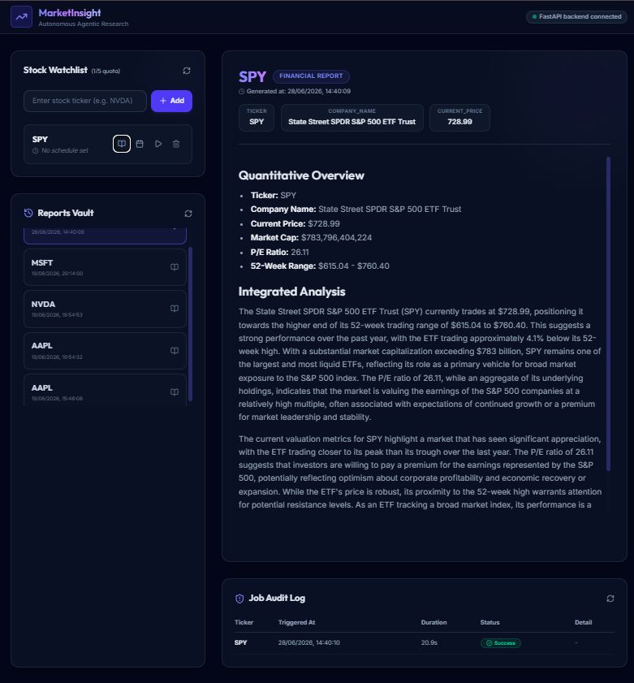
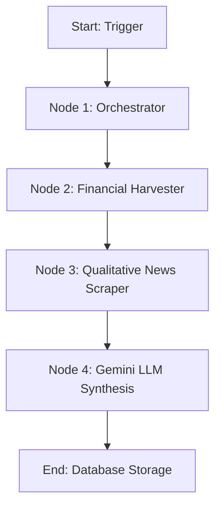

# MarketInsight

**MarketInsight** is a full-stack, autonomous equity research and financial analysis platform. Powered by a multi-agent LangGraph pipeline and Google Gemini, it automatically tracks stock watchlists, harvests real-time market data, and generates comprehensive investment reports on demand or on a recurring daily schedule.

---

## 📸 Project Preview



---

## Tech Stack

The application is split into a decoupled FastAPI backend and a responsive React frontend:

* **Backend**: FastAPI, SQLAlchemy (Asynchronous SQLite database wrapper), LangGraph, LangChain, Google Gemini API (`gemini-2.5-flash`), APScheduler (recurring daily jobs).
* **Frontend**: React, Vite, Tailwind CSS v4, Lucide React (icons), React Markdown (report rendering).

---

## Key Features

1. **Watchlist Manager**: Monitor up to 5 custom stock tickers. Add new tickers with automatic capitalization, and remove them dynamically.
2. **Automated & Scheduled Report Generation**: 
   * **On-Demand**: Trigger a multi-agent analysis run immediately from the dashboard.
   * **Scheduled**: Configure custom daily cron jobs (hour, minute, and local timezone translation) to run reports automatically.
3. **Interactive Report Vault**: Displays deep fundamental and qualitative analysis in a clean card-based viewer featuring markdown formatting and key quantitative metrics (Market Cap, P/E, EPS, etc.).
4. **Job Audit Log**: Track historical background runs, execution times, success rates, and stack trace logs for failed pipelines.
5. **Concurrency Safety**: Implements pessimistic `SELECT FOR UPDATE` database locking to prevent concurrent pipelines from running for the same ticker simultaneously.
6. **API Rate Limit Guard**: Utilizes an asynchronous semaphore lock to throttle LLM requests, preventing `HTTP 429` rate-limiting failures on free tier models.

---

## System Architecture

The analysis is driven by a stateful multi-agent system built using LangGraph:



* **Node 1: Orchestrator**: Initializes state variables and manages pipeline execution context.
* **Node 2: Financial Harvester**: Gathers key quantitative financial metrics (balance sheets, margins, valuation indicators).
* **Node 3: Qualitative News Scraper**: Gathers latest articles and online publications relating to the ticker.
* **Node 4: Gemini LLM Synthesis**: Combines qualitative and quantitative data using strict Pydantic schema validation. In the absence of articles, it gracefully falls back to a fundamental two-paragraph quantitative-only analysis.

---

## Technical Challenges & Solutions

### Handling API Limitations & Data Volatility
A core challenge involved mitigating the data instability and access restrictions inherent to the `yfinance` library, which relies on free, rate-limited endpoints that frequently return `null` values or restrict access to critical metrics like Price-to-Earnings (P/E) ratios. Rather than allowing missing fields to degrade the user experience or trigger runtime exceptions, I engineered a resilient Python fallback layer. When primary endpoints fail to deliver complete data, custom algorithms intercept the response to dynamically compute missing indicators in real time—such as deriving the P/E ratio on the fly using live market prices and trailing Earnings Per Share (EPS). This architectural design elevates the application into a highly robust, fault-tolerant platform, distinguishing it from conventional tools that blindly rely on brittle API wrappers.

---

## Getting Started

### Prerequisites
* Python 3.10+
* Node.js 18+ & npm
* A Gemini API key (configured in your `.env`)

---

### 1. Setup Backend (FastAPI)

1. Navigate to the root directory and create a virtual environment:
   ```bash
   python -m venv .venv
   ```
2. Activate the virtual environment:
   * **Windows (PowerShell)**: `.venv\Scripts\Activate.ps1`
   * **macOS/Linux**: `source .venv/bin/activate`
3. Install dependencies:
   ```bash
   pip install -r requirements.txt
   ```
4. Create a `.env` file in the root directory and populate your credentials:
   ```env
   GEMINI_API_KEY=your_gemini_api_key_here
   DATABASE_URL=sqlite+aiosqlite:///jobs.sqlite
   ```
5. Initialize the database schema:
   ```bash
   python -m app.init_db
   ```
6. Start the FastAPI development server:
   ```bash
   uvicorn app.main:app --reload
   ```
   *The backend documentation will be live at `http://127.0.0.1:8000/docs`.*

---

### 2. Setup Frontend (React + Vite)

1. Open a new terminal and navigate to the `frontend` folder:
   ```bash
   cd frontend
   ```
2. Install npm packages:
   ```bash
   npm install
   ```
3. Start the Vite development server:
   ```bash
   npm run dev
   ```
   *The React dashboard will be live at `http://localhost:5173` (or the port specified in terminal).*

---

## Project Structure

```text
MarketInsight/
├── app/                  # FastAPI Backend
│   ├── agent.py          # LangGraph Multi-Agent implementation
│   ├── database.py       # Async SQLAlchemy database session setup
│   ├── harvesters.py     # Quantitative & qualitative scraper helpers
│   ├── main.py           # FastAPI routes & APScheduler setup
│   ├── models.py         # SQLAlchemy schemas (Watchlist, Reports, Jobs)
│   └── init_db.py        # Database migration initialization
├── frontend/             # React Frontend
│   ├── src/
│   │   ├── App.jsx       # Main Dashboard UI & React State
│   │   ├── index.css     # Tailwind v4 configuration & base styles
│   │   └── main.jsx      # React entrypoint
│   ├── index.html        # HTML layout shell
│   └── vite.config.js    # Vite configuration & dev proxy
```

Development Note: This project was developed and tested locally over several months. This repository was initialized and pushed in June 2026 to consolidate the final stable codebase and documentation.
